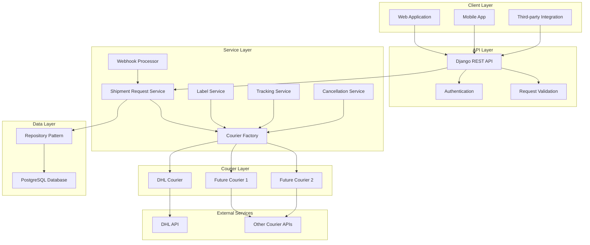
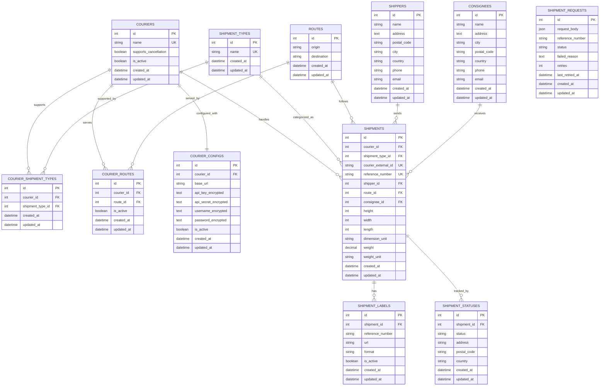
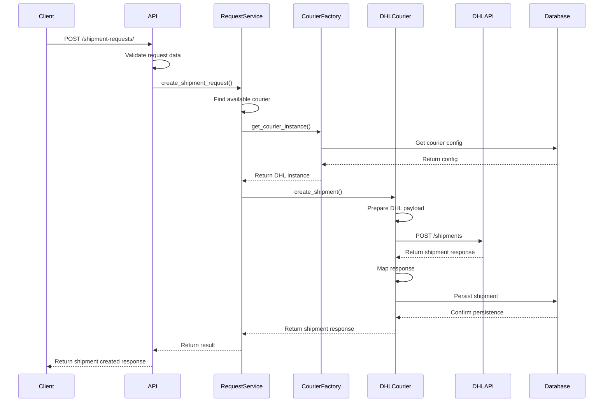
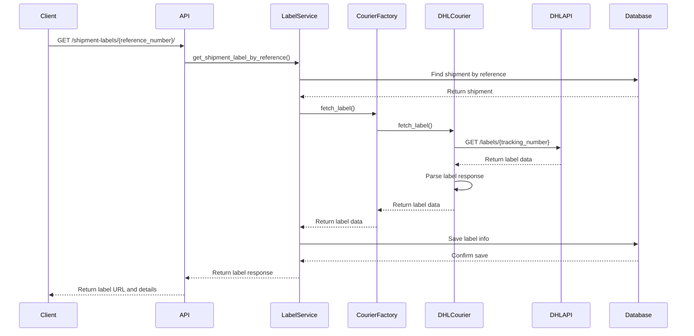
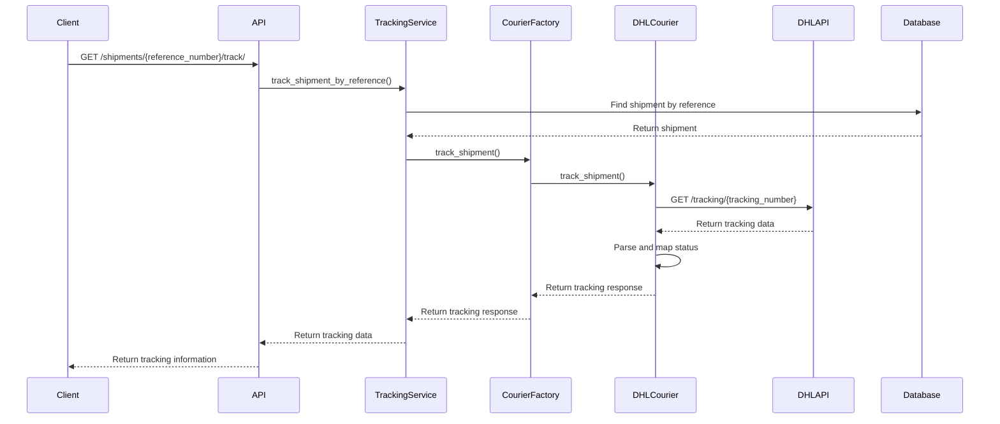
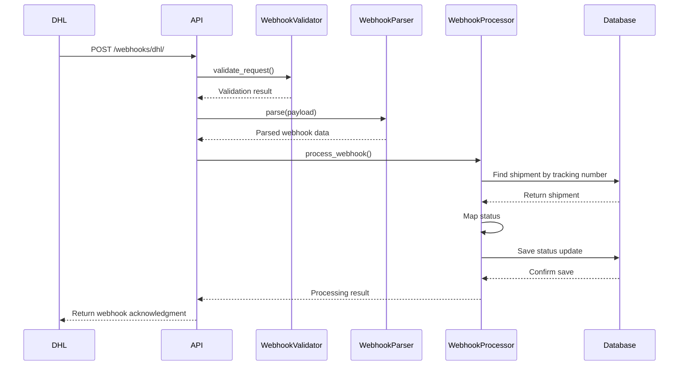
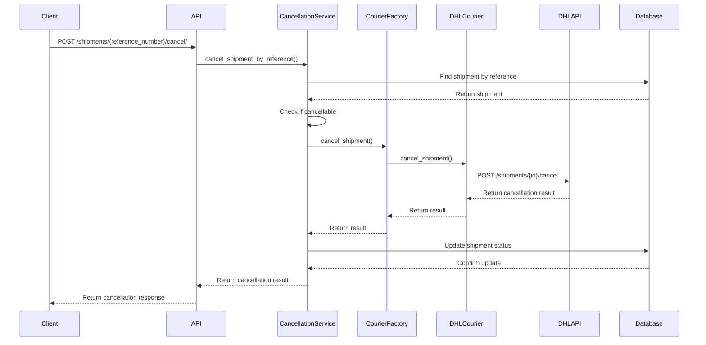

# Couriers Unified API

A unified shipping API that integrates with multiple courier services (currently DHL) to provide a single interface for creating shipments, tracking packages, printing labels, and handling cancellations. Built with Django REST Framework and designed for scalability and easy courier integration.

## 🚀 Quick Start

### Prerequisites

- Docker and Docker Compose
- Git

### Installation

1. **Clone the repository**
   ```bash
   git clone <repository-url>
   cd couriers-unified
   ```

2. **Start the application with Docker Compose**
   ```bash
   docker-compose up --build
   ```

3. **Access the application**
   - API Base URL: `http://localhost:8000`
   - Database: PostgreSQL on port `5433`

The application will automatically:
- Set up the PostgreSQL database
- Run database migrations
- Seed initial data (couriers, routes, shipment types)
- Start the Django development server

### Database Credentials

**Development Database:**
- Host: `localhost` (or `db` from within Docker)
- Port: `5433`
- Database: `devdb`
- Username: `devuser`
- Password: `changeme`

**⚠️ Security Note:** In production, move these credentials to a `.env` file and update `settings.py` to use environment variables. The current setup is for development only.

## 🏗️ System Architecture

The system follows a modular, service-oriented architecture designed for easy courier integration and maintainability.

### High-Level Architecture



### Detailed Component Architecture

```mermaid
graph TB
    subgraph "Django Application"
        subgraph "API Endpoints"
            A1[POST /shipment-requests/]
            A2[GET /shipment-labels/{ref}/]
            A3[GET /shipments/{ref}/track/]
            A4[POST /shipments/{ref}/cancel/]
            A5[POST /webhooks/dhl/]
        end
        
        subgraph "Service Layer"
            B1[ShipmentRequestService]
            B2[ShipmentLabelService]
            B3[ShipmentTrackingService]
            B4[ShipmentCancellationService]
            B5[WebhookProcessor]
        end
        
        subgraph "Courier Integration"
            C1[CourierFactory]
            C2[BaseCourier]
            C3[DHLCourier]
            C4[HTTP Clients]
            C5[Response Mappers]
        end
        
        subgraph "Data Access"
            D1[Repository Pattern]
            D2[Model Managers]
            D3[Database Queries]
        end
    end
    
    subgraph "Database Layer"
        E1[(PostgreSQL)]
        E2[Core Models]
        E3[Shipment Models]
        E4[Encrypted Configs]
    end
    
    subgraph "External APIs"
        F1[DHL Express API]
        F2[Future Courier APIs]
    end
    
    subgraph "Background Processing"
        G1[Celery Worker]
        G2[Request Processor]
        G3[Batch Processor]
    end
    
    A1 --> B1
    A2 --> B2
    A3 --> B3
    A4 --> B4
    A5 --> B5
    
    B1 --> C1
    B2 --> C1
    B3 --> C1
    B4 --> C1
    
    C1 --> C2
    C2 --> C3
    C3 --> C4
    C4 --> F1
    
    B1 --> D1
    B2 --> D1
    B3 --> D1
    B4 --> D1
    
    D1 --> E1
    E1 --> E2
    E1 --> E3
    E1 --> E4
    
    B1 --> G1
    G1 --> G2
    G2 --> G3
```

### Key Components

- **API Layer**: Django REST Framework endpoints for all operations
- **Service Layer**: Business logic and orchestration
- **Courier Layer**: Pluggable courier implementations
- **Repository Layer**: Data access abstraction
- **Webhook Processing**: Real-time status updates from couriers

## 🗄️ Database Schema (ERD)



## 🔄 API Sequence Diagrams

### 1. Create Shipment



### 2. Print Label



### 3. Track Shipment



### 4. Status Webhook



### 5. Cancel Shipment



## 📚 API Documentation

### Base URL
```
http://localhost:8000
```

### 1. Create Shipment Request

**Endpoint:** `POST /shipment-requests/`

**Request Body:**
```json
{
  "shipment_type": "express",
  "reference_number": "REF-2024-001",
  "shipper": {
    "name": "John Doe",
    "address": "123 Main St",
    "city": "New York",
    "country": "USA",
    "phone": "+1234567890",
    "email": "john@example.com",
    "postal_code": "10001"
  },
  "consignee": {
    "name": "Jane Smith",
    "address": "456 Oak Ave",
    "city": "Los Angeles",
    "country": "USA",
    "phone": "+1987654321",
    "email": "jane@example.com",
    "postal_code": "90210"
  },
  "route": {
    "origin": "New York",
    "destination": "Los Angeles"
  },
  "weight": {
    "value": 2.5,
    "unit": "kg"
  },
  "dimensions": {
    "height": 30,
    "width": 20,
    "length": 40,
    "unit": "cm"
  },
  "pickup_date": "2024-01-15",
  "special_instructions": "Handle with care"
}
```

**Success Response (201):**
```json
{
  "success": true,
  "message": "Shipment request created successfully",
  "data": {
    "request_id": 1,
    "reference_number": "REF-2024-001",
    "status": "processing",
    "courier": "DHL",
    "tracking_number": "DHL123456789",
    "estimated_delivery": "2024-01-17T10:00:00Z",
    "created_at": "2024-01-15T09:30:00Z"
  }
}
```

**Error Response (400):**
```json
{
  "success": false,
  "message": "Validation failed",
  "errors": {
    "reference_number": ["This field is required."],
    "weight": ["Weight must be greater than 0."]
  }
}
```

### 2. Get Shipment Label

**Endpoint:** `GET /shipment-labels/{reference_number}/`

**Success Response (200):**
```json
{
  "success": true,
  "data": {
    "id": 1,
    "reference_number": "REF-2024-001",
    "url": "https://api.dhl.com/labels/DHL123456789.pdf",
    "format": "PDF",
    "is_active": true,
    "created_at": "2024-01-15T09:35:00Z"
  }
}
```

**Error Response (404):**
```json
{
  "success": false,
  "error": "Shipment not found",
  "error_code": "SHIPMENT_NOT_FOUND"
}
```

### 3. Track Shipment

**Endpoint:** `GET /shipments/{reference_number}/track/`

**Success Response (200):**
```json
{
  "success": true,
  "service": "DHL Express",
  "current_status": "IN_TRANSIT",
  "status_description": "Package is in transit",
  "current_location": {
    "address": "DHL Sorting Facility",
    "country": "USA",
    "postal_code": "10001"
  },
  "events": [
    {
      "timestamp": "2024-01-15T09:30:00Z",
      "status": "PICKED_UP",
      "description": "Package picked up from sender",
      "location": {
        "address": "123 Main St",
        "country": "USA",
        "postal_code": "10001"
      }
    },
    {
      "timestamp": "2024-01-15T14:20:00Z",
      "status": "IN_TRANSIT",
      "description": "Package is in transit",
      "location": {
        "address": "DHL Sorting Facility",
        "country": "USA",
        "postal_code": "10001"
      }
    }
  ],
  "origin": {
    "address": "123 Main St",
    "city": "New York",
    "country": "USA",
    "postal_code": "10001"
  },
  "destination": {
    "address": "456 Oak Ave",
    "city": "Los Angeles",
    "country": "USA",
    "postal_code": "90210"
  },
  "reference_number": "REF-2024-001",
  "shipment_id": 1
}
```

### 4. Cancel Shipment

**Endpoint:** `POST /shipments/{reference_number}/cancel/`

**Success Response (200):**
```json
{
  "success": true,
  "message": "Shipment cancelled successfully",
  "data": {
    "shipment_id": 1,
    "reference_number": "REF-2024-001"
  }
}
```

**Error Response (400):**
```json
{
  "success": false,
  "message": "Shipment cannot be cancelled",
  "error_code": "CANCELLATION_NOT_ALLOWED"
}
```

### 5. DHL Webhook

**Endpoint:** `POST /webhooks/dhl/`

**Headers:**
```
X-API-Key: dhl-webhook-secret-key-2024
Content-Type: application/json
```

**Request Body:**
```json
{
  "tracking_number": "DHL123456789",
  "status": "DELIVERED",
  "timestamp": "2024-01-17T10:30:00Z",
  "location": {
    "address": "456 Oak Ave",
    "city": "Los Angeles",
    "country": "USA",
    "postal_code": "90210"
  }
}
```

**Success Response (200):**
```json
{
  "success": true,
  "message": "Webhook processed successfully",
  "data": {
    "shipment_id": 1,
    "reference_number": "REF-2024-001",
    "status_entry_id": 3,
    "mapped_status": "DELIVERED"
  }
}
```

## 🔧 Adding a New Courier

The system is designed to easily integrate new courier services. Here's a step-by-step guide:

### Step 1: Database Setup

1. **Add courier to database:**
   ```python
   # Run Django shell: python manage.py shell
   from core.models import Courier, CourierConfig
   
   # Create courier
   courier = Courier.objects.create(
       name="FedEx",
       supports_cancellation=True,
       is_active=True
   )
   
   # Create configuration
   CourierConfig.objects.create(
       courier=courier,
       base_url="https://api.fedex.com/v1",
       api_key="your-api-key",
       api_secret="your-api-secret",
       is_active=True
   )
   ```

2. **Add supported routes and shipment types:**
   ```python
   from core.models import Route, ShipmentType, CourierRoute, CourierShipmentType
   
   # Add routes
   route = Route.objects.create(origin="New York", destination="Los Angeles")
   CourierRoute.objects.create(courier=courier, route=route, is_active=True)
   
   # Add shipment types
   shipment_type = ShipmentType.objects.create(name="express")
   CourierShipmentType.objects.create(courier=courier, shipment_type=shipment_type)
   ```

### Step 2: Create Courier Implementation

1. **Create HTTP Client:**
   ```python
   # app/shipment/services/http_clients/fedex_client.py
   from .base_client import BaseHttpClient
   
   class FedExHttpClient(BaseHttpClient):
       def __init__(self, base_url, api_key, api_secret, **kwargs):
           super().__init__(base_url, **kwargs)
           self.api_key = api_key
           self.api_secret = api_secret
       
       def create_shipment(self, payload):
           # Implement FedEx shipment creation
           pass
       
       def get_label(self, tracking_number):
           # Implement FedEx label fetching
           pass
       
       def track_shipment(self, tracking_number):
           # Implement FedEx tracking
           pass
   ```

2. **Create Courier Class:**
   ```python
   # app/shipment/services/couriers/fedex_courier.py
   from .base_courier import BaseCourier
   from ..http_clients.fedex_client import FedExHttpClient
   
   class FedExCourier(BaseCourier):
       def _create_http_client(self):
           return FedExHttpClient(
               base_url=self.config.get('base_url'),
               api_key=self.config.get('api_key'),
               api_secret=self.config.get('api_secret')
           )
       
       def _prepare_payload(self, request):
           # Convert unified request to FedEx format
           pass
       
       def _map_response(self, response_data):
           # Convert FedEx response to unified format
           pass
       
       def fetch_label(self, courier_external_id):
           # Implement label fetching
           pass
       
       def track_shipment(self, courier_external_id):
           # Implement tracking
           pass
   ```

3. **Create Mapping Services:**
   ```python
   # app/shipment/services/mapping/fedex/fedex_payload_builder.py
   def build_fedex_payload(request):
       # Convert unified request to FedEx API format
       pass
   
   # app/shipment/services/mapping/fedex/fedex_response_mapper.py
   def map_fedex_response_to_shipment_response(response_data, success):
       # Convert FedEx response to unified format
       pass
   ```

### Step 3: Register Courier

1. **Update Courier Factory:**
   ```python
   # app/shipment/services/couriers/courier_factory.py
   from .fedex_courier import FedExCourier
   
   class CourierFactory:
       COURIER_CLASSES = {
           'dhl': DHLCourier,
           'fedex': FedExCourier,  # Add new courier
       }
   ```

2. **Add Status Mapping (if needed):**
   ```python
   # app/shipment/services/mapping/status_mapping_service.py
   COURIER_STATUS_MAPPING = {
       'dhl': {...},
       'fedex': {  # Add FedEx status mapping
           'PICKED_UP': {'status': 'PICKED_UP', 'description': 'Package picked up'},
           'IN_TRANSIT': {'status': 'IN_TRANSIT', 'description': 'Package in transit'},
           # ... more mappings
       }
   }
   ```

### Step 4: Add Webhook Support (Optional)

1. **Create Webhook Parser:**
   ```python
   # app/shipment/services/webhooks/fedex_webhook_parser.py
   class FedExWebhookParser:
       @staticmethod
       def parse(payload):
           # Parse FedEx webhook payload
           pass
   ```

2. **Add Webhook Endpoint:**
   ```python
   # app/shipment/urls.py
   urlpatterns = [
       # ... existing patterns
       path('webhooks/fedex/', webhook_views.fedex_webhook, name='fedex_webhook'),
   ]
   ```

### Step 5: Testing

1. **Create test data:**
   ```python
   # Test the new courier integration
   from shipment.services.couriers.courier_factory import courier_factory
   
   # Test shipment creation
   courier = courier_factory.get_courier_instance('fedex')
   # ... test implementation
   ```

2. **Run tests:**
   ```bash
   python manage.py test
   ```

### Step 6: Documentation

Update this README with:
- New courier in the system architecture diagram
- API examples for the new courier
- Any courier-specific configuration requirements

## 🛠️ Development

### Running Tests
```bash
docker-compose exec app python manage.py test
```

### Database Migrations
```bash
docker-compose exec app python manage.py makemigrations
docker-compose exec app python manage.py migrate
```

### Seeding Data
```bash
docker-compose exec app python manage.py seed_all
```

### Background Worker
The system includes a background worker for processing shipment requests:
```bash
./run_worker.sh
```

## 📝 Environment Variables

### Current Setup (Development)
The application currently uses hardcoded values in `settings.py` for development convenience.

### Production Setup (Recommended)
For production deployment, create a `.env` file in the project root:

```bash
# .env file
DB_HOST=your-db-host
DB_NAME=your-db-name
DB_USER=your-db-user
DB_PASS=your-secure-password
DHL_WEBHOOK_API_KEY=your-dhl-webhook-key
SECRET_KEY=your-django-secret-key
ENCRYPTION_KEY=your-encryption-key
```

Then update `settings.py` to use environment variables:

```python
import os
from dotenv import load_dotenv

load_dotenv()

SECRET_KEY = os.environ.get('SECRET_KEY', 'django-insecure-default')
ENCRYPTION_KEY = os.environ.get('ENCRYPTION_KEY', 'default-key').encode()
DHL_WEBHOOK_API_KEY = os.environ.get('DHL_WEBHOOK_API_KEY', 'dhl-webhook-secret-key-2024')

DATABASES = {
    'default': {
        'ENGINE': 'django.db.backends.postgresql',
        'HOST': os.environ.get('DB_HOST', 'db'),
        'NAME': os.environ.get('DB_NAME', 'devdb'),
        'USER': os.environ.get('DB_USER', 'devuser'),
        'PASSWORD': os.environ.get('DB_PASS', 'changeme'),
    }
}
```

### Environment Variables Reference

| Variable | Description | Default | Required |
|----------|-------------|---------|----------|
| `DB_HOST` | Database host | `db` | Yes |
| `DB_NAME` | Database name | `devdb` | Yes |
| `DB_USER` | Database user | `devuser` | Yes |
| `DB_PASS` | Database password | `changeme` | Yes |
| `DHL_WEBHOOK_API_KEY` | DHL webhook authentication key | `dhl-webhook-secret-key-2024` | Yes |
| `SECRET_KEY` | Django secret key | `django-insecure-default` | Yes |
| `ENCRYPTION_KEY` | Encryption key for sensitive data | `default-key` | Yes |

## 🤝 Contributing

1. Fork the repository
2. Create a feature branch
3. Make your changes
4. Add tests for new functionality
5. Submit a pull request

## 📄 License

This project is licensed under the MIT License - see the LICENSE file for details.

---

**Need help?** Check the API documentation or create an issue in the repository.
