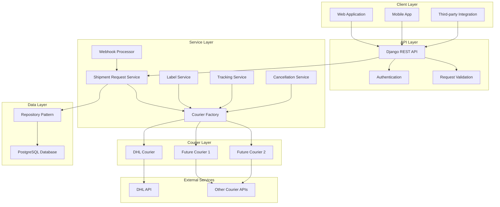
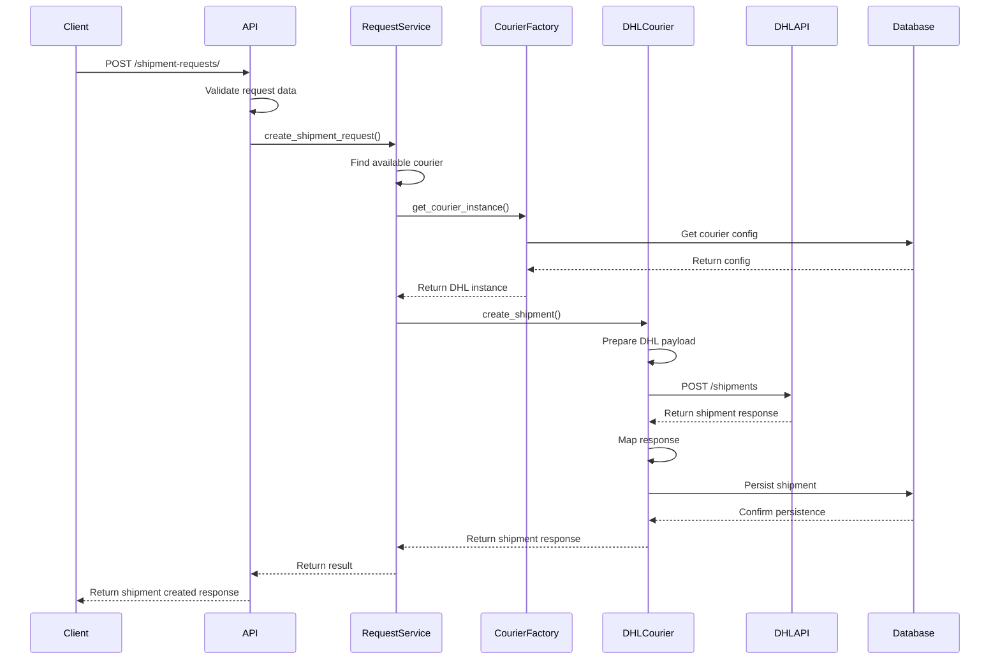
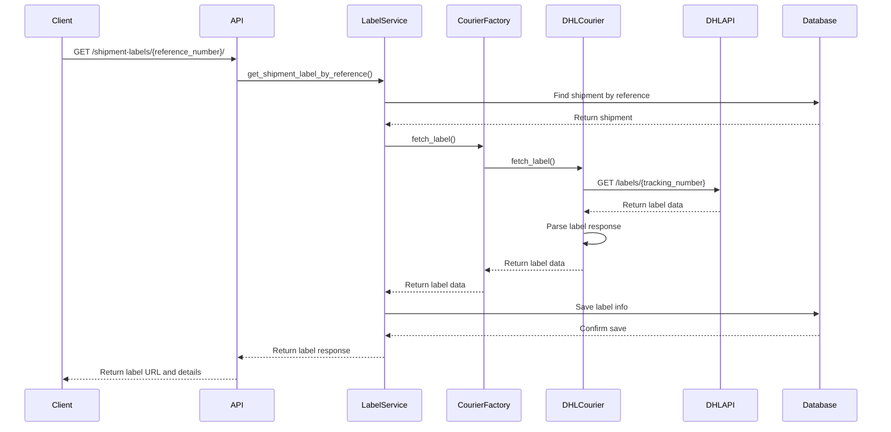
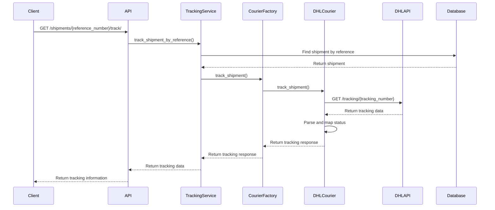
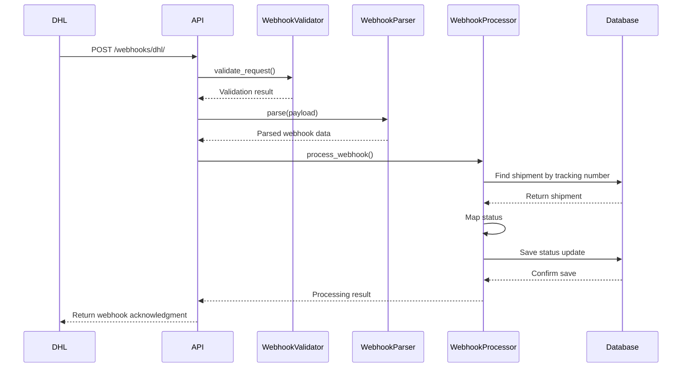
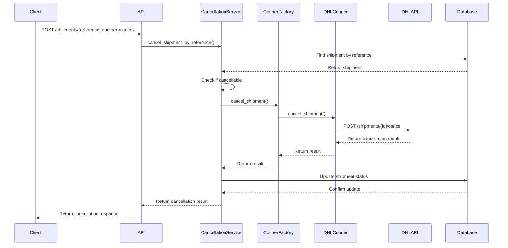

# Couriers Unified API

A unified shipping API that integrates with multiple courier services (currently DHL) to provide a single interface for creating shipments, tracking packages, printing labels, and handling cancellations. Built with Django REST Framework and designed for scalability and easy courier integration.

## 🚀 Quick Start

### Prerequisites

- Docker and Docker Compose
- Git

### Installation

1. **Clone the repository**
   ```bash
   git clone <repository-url>
   cd couriers-unified
   ```

2. **Start the application with Docker Compose**
   ```bash
   docker-compose up --build
   ```

   
3. **Start the Background Worker**
The system includes a background worker for processing shipment requests:
```bash
./run_worker.sh
```

4. **Access the application**
   - API Base URL: `http://localhost:8000`
   - Database: PostgreSQL on port `5433`

The application will automatically:
- Set up the PostgreSQL database
- Run database migrations
- Seed initial data (couriers, routes, shipment types)
- Start the Django development server

### Database Credentials

**Development Database:**
- Host: `localhost` (or `db` from within Docker)
- Port: `5433`
- Database: `devdb`
- Username: `devuser`
- Password: `changeme`

**⚠️ Security Note:** In production, move these credentials to a `.env` file and update `settings.py` to use environment variables. The current setup is for development only.

## 🏗️ System Architecture

The system follows a modular, service-oriented architecture designed for easy courier integration and maintainability.

### High-Level Architecture



### Key Components

- **API Layer**: Django REST Framework endpoints for all operations
- **Service Layer**: Business logic and orchestration
- **Courier Layer**: Pluggable courier implementations
- **Repository Layer**: Data access abstraction
- **Webhook Processing**: Real-time status updates from couriers

## 🗄️ Database Schema (ERD)


## 🔄 API Sequence Diagrams

### 1. Create Shipment



### 2. Print Label



### 3. Track Shipment



### 4. Status Webhook



### 5. Cancel Shipment



## 📦 Shipment Types

Shipment types define the delivery speed and service level for your packages. Each courier supports different shipment types, and the system automatically maps these to the appropriate courier-specific product codes.

### Available Shipment Types

| ID | Name | Description | DHL Product Code | Supported by DHL |
|----|------|-------------|------------------|------------------|
| 1 | `NORMAL` | Standard delivery (1-3 business days) | `V01PAK` | ✅ |
| 2 | `URGENT` | Express delivery (1-2 business days) | `V53WPAK` | ✅ |
| 3 | `SAME_DAY_DELIVERY` | Same-day delivery | `V54EPAK` | ❌ |

### How Shipment Types Work

1. **Courier Compatibility**: Not all couriers support all shipment types. The system maintains a mapping table (`courier_shipment_types`) that defines which shipment types each courier can handle.

2. **Automatic Mapping**: When you create a shipment request, the system:
   - Validates that the requested courier supports the specified shipment type
   - Maps the internal shipment type to the courier's specific product code
   - Uses the appropriate courier API parameters

### Using Shipment Types in API Requests

When creating a shipment request, specify the `shipment_type_id` in your request:

```json
{
  "shipment_type_id": 1,  // Use ID 1 for NORMAL delivery
  "reference_number": "REF123456",
  // ... other fields
}
```

## 📚 API Documentation

### 1. Create Shipment Request

**Endpoint:** `POST /shipment-requests/`

**cURL Example:**
```bash
curl --location 'http://localhost:8000/api/v1/shipment-requests/' \
--header 'Accept: application/json' \
--header 'Content-Type: application/json' \
--data-raw '{
    "shipment_type_id": 2,
    "reference_number": "REF123437",
    "shipper": {
        "name": "John Doe",
        "address": "123 Main Street, Al Olaya",
        "city": "Berlin",
        "country": "DEU",
        "phone": "+966501234567",
        "email": "john.doe1@example.com",
        "postal_code": 12235
    },
    "consignee": {
        "name": "Jane Smith",
        "address": "456 King Abdulaziz Road",
        "city": "Bonn",
        "country": "DEU",
        "phone": "+966509876543",
        "email": "jane.smith1@example.com",
        "postal_code": 12345
    },
    "pickup_date": "2024-01-15",
    "weight": 1.2,
    "weight_unit": "kg",
    "dimensions": {
        "length": 50,
        "width": 30,
        "height": 20
    },
    "dimension_unit": "mm",
    "special_instructions": "Handle with care. Fragile items included."
}'
```

**Request Body Schema:**
```json
{
  "shipment_type_id": 2,
  "reference_number": "REF123437",
  "shipper": {
    "name": "John Doe",
    "address": "123 Main Street, Al Olaya",
    "city": "Berlin",
    "country": "DEU",
    "phone": "+966501234567",
    "email": "john.doe1@example.com",
    "postal_code": 12235
  },
  "consignee": {
    "name": "Jane Smith",
    "address": "456 King Abdulaziz Road",
    "city": "Bonn",
    "country": "DEU",
    "phone": "+966509876543",
    "email": "jane.smith1@example.com",
    "postal_code": 12345
  },
  "pickup_date": "2024-01-15",
  "weight": 1.2,
  "weight_unit": "kg",
  "dimensions": {
    "length": 50,
    "width": 30,
    "height": 20
  },
  "dimension_unit": "mm",
  "special_instructions": "Handle with care. Fragile items included."
}
```

**Success Response (201):**
```json
{
    "success": true,
    "message": "Shipment request created successfully",
    "data": {
        "id": 1,
        "reference_number": "REF123437",
        "status": "pending",
        "created_at": "2025-10-21T20:24:07.444955+00:00",
        "shipper_id": 1,
        "consignee_id": 1
    }
}
```

### 2. Get Shipment Label

**Endpoint:** `GET /shipment-labels/{reference_number}`

**cURL Example:**
```bash
curl --location 'http://localhost:8000/api/v1/shipment-labels/REF123437'
```

**Success Response (200):**
```json
{
    "success": true,
    "message": "Label retrieved successfully",
    "data": {
        "id": 3,
        "reference_number": "REF123437",
        "url": "https://api-sandbox.dhl.com/parcel/de/shipping/v2/labels?token=x5xzrHE7ctmqPqk33k%2BKkKVOF7rDdlCe35HwWACAmA5yiaN4QeyVlJ2S%2FyRW1IQrbsqJ%2Bf%2FB4JuUWex0tKUE%2BOrgzoO6MrjST%2FOE69eW2sTHRtM0vUAgsEvI6lLukTpUO3NpawftZJ%2FeqEIwt8R1eh9E0HUyjNbAudun7tcX68jsnJ6p9%2FQD8AocXOJE0XcD",
        "format": "PDF",
        "is_active": true,
        "created_at": "2025-10-21T21:16:09.008546+00:00"
    }
}
```

### 3. Track Shipment

**Endpoint:** `GET /api/v1/shipments/{reference_number}/track`

**cURL Example:**
```bash
curl --location 'http://localhost:8000/api/v1/shipments/REF123437/track'
```

**Success Response (200):**
```json
{
    "success": true,
    "message": "Tracking information retrieved successfully",
    "data": {
        "service": "DHL",
        "current_status": "created",
        "status_description": "Created",
        "current_location": {
            "address": "123 Main Street, Al Olaya, Berlin",
            "country": "DEU",
            "postal_code": "12235"
        },
        "events": [
            {
                "timestamp": "2025-10-21T20:24:13.736251+00:00",
                "status": "created",
                "description": "Created",
                "location": {
                    "address": "123 Main Street, Al Olaya, Berlin",
                    "country": "DEU",
                    "postal_code": "12235"
                }
            }
        ],
        "origin": {
            "address": "123 Main Street, Al Olaya",
            "city": "Berlin",
            "country": "DEU",
            "postal_code": "12235"
        },
        "destination": {
            "address": "456 King Abdulaziz Road",
            "city": "Bonn",
            "country": "DEU",
            "postal_code": "12345"
        },
        "reference_number": "REF123437",
        "shipment_id": 5,
        "error": null,
        "error_code": null
    }
}
```

### 4. Cancel Shipment

**Endpoint:** `POST /api/v1/shipments/{reference_number}/cancel/`

**cURL Example:**
```bash
curl --location --request POST 'http://localhost:8000/api/v1/shipments/REF123437/cancel/'
```

**Success Response (200):**
```json
{
    "success": true,
    "message": "Shipment cancelled successfully",
    "data": {
        "shipment_id": 5,
        "reference_number": "REF123437",
        "cancelled_at": "2025-10-21T21:18:29.243064"
    }
}
```

### 5. DHL Webhook

**Endpoint:** `POST /api/v1/webhooks/dhl/`

**cURL Example:**
```bash
curl --location 'http://localhost:8000/api/v1/webhooks/dhl/' \
--header 'X-API-Key: dhl-webhook-secret-key-2024' \
--header 'Content-Type: application/json' \
--data '{
    "tracking_number": "0034043333301020017128697",
    "status": "in_transit",
    "location": {
        "countryCode": "DEU",
        "postalCode": "12345",
        "addressLocality": "456 King Abdulaziz Road"
    }
}'
```

**Headers:**
```
X-API-Key: dhl-webhook-secret-key-2024
Content-Type: application/json
```

**Request Body:**
```json
{
    "tracking_number": "0034043333301020017128697",
    "status": "in_transit",
    "location": {
        "countryCode": "DEU",
        "postalCode": "12345",
        "addressLocality": "456 King Abdulaziz Road"
    }
}
```

**Important Notes:**
- The `tracking_number` in the webhook payload is the **courier's tracking number** (e.g., DHL's tracking number)
- The system maps this to our internal shipment by searching the `shipments` table using the `courier_external_id` field
- This allows us to track status updates from couriers using their native tracking identifiers

**Success Response (200):**
```json
{
    "success": true,
    "message": "Webhook processed successfully",
    "data": {
        "shipment_id": 4,
        "reference_number": "REF123427",
        "status_entry_id": 13,
        "mapped_status": "in_transit"
    }
}
```

## 🔧 Adding a New Courier

The system is designed to easily integrate new courier services. Here's a simple step-by-step guide:

### 1. Database Setup
- Add courier to `Courier` table
- Create `CourierConfig` with API credentials
- Add supported routes and shipment types

### 2. Create HTTP Client
- Extend `BaseHttpClient` class
- Implement `create_shipment()`, `get_label()`, `track_shipment()` methods

### 3. Create Courier Class
- Extend `BaseCourier` class
- Implement `_prepare_payload()`, `_map_response()`, `fetch_label()`, `track_shipment()` methods

### 4. Create Mapping Services
- Build payload converter for courier API format
- Create response mapper to unified format
- Add status mapping if needed

### 5. Register Courier
- Add courier class to `CourierFactory.COURIER_CLASSES`
- Update status mapping service

### 6. Add Webhook Support (Optional)
- Create webhook parser
- Add webhook endpoint to URLs

### 7. Test Integration
- Test shipment creation, label fetching, and tracking
- Run test suite to ensure compatibility

## 🛠️ Development

### Running Tests
```bash
docker-compose exec app python manage.py test
```

### Running Background Worker
```bash
# Start the background worker using the shell script
sh worker.sh

### Database Migrations
```bash
docker-compose exec app python manage.py makemigrations
docker-compose exec app python manage.py migrate
```

### Seeding Data
```bash
docker-compose exec app python manage.py seed_all
```

## 📝 Environment Variables

### Current Setup (Development)
The application currently uses hardcoded values in `settings.py` for development convenience.

### Production Setup (Recommended)
For production deployment, create a `.env` file in the project root:

```bash
# .env file
DB_HOST=your-db-host
DB_NAME=your-db-name
DB_USER=your-db-user
DB_PASS=your-secure-password
DHL_WEBHOOK_API_KEY=your-dhl-webhook-key
SECRET_KEY=your-django-secret-key
ENCRYPTION_KEY=your-encryption-key
```

Then update `settings.py` to use environment variables:

```python
import os
from dotenv import load_dotenv

load_dotenv()

SECRET_KEY = os.environ.get('SECRET_KEY', 'django-insecure-default')
ENCRYPTION_KEY = os.environ.get('ENCRYPTION_KEY', 'default-key').encode()
DHL_WEBHOOK_API_KEY = os.environ.get('DHL_WEBHOOK_API_KEY', 'dhl-webhook-secret-key-2024')

DATABASES = {
    'default': {
        'ENGINE': 'django.db.backends.postgresql',
        'HOST': os.environ.get('DB_HOST', 'db'),
        'NAME': os.environ.get('DB_NAME', 'devdb'),
        'USER': os.environ.get('DB_USER', 'devuser'),
        'PASSWORD': os.environ.get('DB_PASS', 'changeme'),
    }
}
```

### Environment Variables Reference

| Variable | Description | Default | Required |
|----------|-------------|---------|----------|
| `DB_HOST` | Database host | `db` | Yes |
| `DB_NAME` | Database name | `devdb` | Yes |
| `DB_USER` | Database user | `devuser` | Yes |
| `DB_PASS` | Database password | `changeme` | Yes |
| `DHL_WEBHOOK_API_KEY` | DHL webhook authentication key | `dhl-webhook-secret-key-2024` | Yes |
| `SECRET_KEY` | Django secret key | `django-insecure-default` | Yes |
| `ENCRYPTION_KEY` | Encryption key for sensitive data | `default-key` | Yes |
